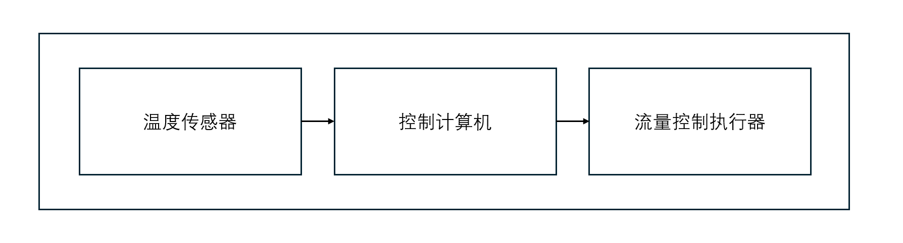
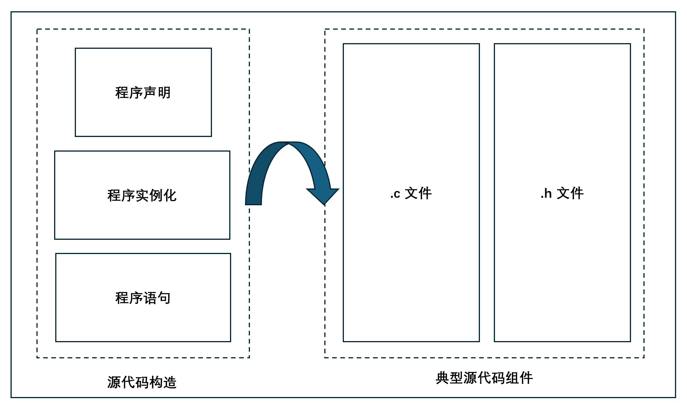
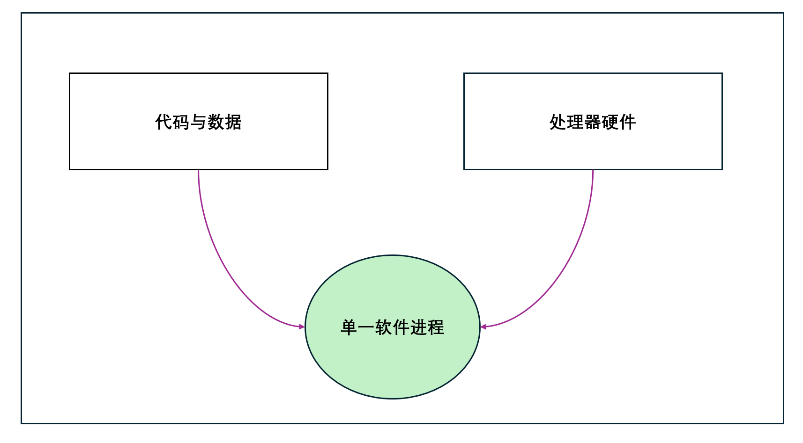

# 前言

**这套书是关于什么的？**
本系列旨在为读者提供开发和构建实时嵌入式系统所需的扎实知识基础与实践技能。全套书大致分为两类：

- 奠定基础性理论的书籍 —— 系统介绍该领域的核心概念与基本原理。
- 讲解具体设计与开发技能应用的书籍 —— 展示如何在实际工程中运用这些方法与工具。

在成熟的传统工程领域（如电子、机械、航空等），工程师们深知这两类内容的区别。更重要的是，经验丰富的工程师都明白：要在实践中熟练运用技能，首先必须真正掌握扎实的基础知识。

遗憾的是，在软件工程领域，这样的认知却并不普遍。

**这套书适合谁阅读？**

本系列旨在满足以下读者的需求——他们正在从事，或计划从事实时嵌入式系统的软件开发工作。作者主要面向以下四类受众：

- 学生。
- 准备转向软件系统领域的工程师、科学家和数学家。
- 即将进入嵌入式领域的专业软件工程师或具有经验的开发者。
- 对软件实时系统原理缺乏系统教育的程序员。

**本书的内容是什么？**

本书主要讲解该领域的基础知识。简单而言，它试图回答以下几个核心问题：

1. 什么是实时操作系统（RTOS）？
2. 为什么在设计中要使用 RTOS？
3. 使用 RTOS 是否存在缺点？
4. 嵌入式实时操作系统由哪些基本构件组成？
5. 现代嵌入式系统可能采用单处理器、多处理器、多核甚至多机结构。RTOS 在如此多样的平台上应如何使用？
6. 如何评估 RTOS 的性能，并在必要时进行改进？
7. 如何调试基于 RTOS 的设计？

目录将更详细地展示预期内容；此外，每一章都会以明确的学习目标开篇。我建议你先快速浏览这些目标，以整体了解本书的范围与意图。

原书已更名，这样做是为了与新增的姊妹篇对应。

这一册包含一系列可选的习题，用来帮助你加深对主题的理解。习题与第 1 到第 5 章所涵盖的核心内容相关。我建议你在学习理论时，同时进行相应的实践练习。这样做会让你在面对真正的 RTOS 设计问题时具备更扎实的能力。

最后，为避免被指责性别偏见，请注意：书中使用 “he” 只是 “he or she” 的简写。

**应当如何阅读本书？**

无论你是否有经验，请一定、一定要先读第一章。不仅要读，还要真正理解其中的核心思想。因为如果你无法充分理解本章讨论的问题，今后要做出良好的设计会非常困难。

第 2 至第 6 章讲解本领域的基础知识。它们不仅展示多任务设计如何实现，还解释为什么要以特定方式来进行设计。这几章主要面向首次接触实时嵌入式系统任务设计与实现的读者。但需要强调的是：这些内容主要围绕单处理器系统展开。

第 7 和第 8 章将视野进一步扩展到多处理器系统和分布式系统（并且有必要指出，这两者之间的界限有时并不十分清晰）。

第 9 章基本上是偏理论但具有实践倾向的内容，它以更宏观的视角讨论任务调度技术。之所以将这一章放在后半部分，是为了让读者更容易理解材料；只要对前面介绍的基本概念足够熟悉，这一章应当相对容易掌握。

第 10 至第 12 章则聚焦于实践层面。如果你刚进入 RTOS 领域，第 10 章将帮助你理解不同操作系统结构之间的差异，这对你选择第一个 RTOS 会特别有帮助。相比之下，第 11 和第 12 章的内容在系统构建完成后尤其有价值，它们主要关注软件在运行时的行为、质量和可靠性。

**致谢**

略 :)

---

# 第一章 你真正应该了解的实时操作系统知识

本章的目标是：

- 阐明在设计中使用实时操作系统（RTOS）的合理性。
- 指出使用 RTOS 也存在一定的缺点（简单来说，“有利也有弊”）。
- 说明 RTOS 支持如何简化软件的功能设计，从而更容易构建高质量系统。
- 强调在基于 RTOS 的设计中，时间与时序具有特别重要的作用。
- 描述任务式设计的基本目标、结构以及运行机制。

## 1.1 背景铺陈

在大型计算机领域，操作系统（OS）已经存在相当长的时间。事实上，最早的操作系统可以追溯到 20 世纪 50 年代；到了 60 年代出现了关键性的进展，而在 70 年代中期，操作系统的概念、结构、功能以及接口已经非常成熟。

微型计算机大约在 1970 年左右出现。按理说，操作系统应该会迅速在基于微处理器的系统中得到应用。然而到了 80 年代中期，很少有此类系统采用可以被称为“正式设计的实时操作系统”的方案。确实，CP/M 在 1975 年发布，并后来被英特尔固化到芯片中，但它对实时系统领域影响不大——它更适合于桌面计算机。

RTOS 的采用受到两个主要因素的影响：机器自身的限制以及微处理器时代的软件设计文化。早期的微型计算机在计算能力、运行速度和存储容量方面都非常有限。试图在这样的平台上强加一个操作系统结构是相当困难的。此外，当时大多数从事嵌入式系统编程的人并没有操作系统方面的背景知识。

如今情况已截然不同。现代嵌入式设计的主力是 16/32 位的复杂微控制器。这些器件具有低成本、高性能的优势，并集成了大量片上内存和外设功能。同时，市场上也存在非常多的商业 RTOS 可供选择。

然而，能做某件事并不等于应该做。因此，在下一次设计中，你究竟为什么要选择使用 RTOS？

在回答这个问题之前，我们需要先讨论一个更基本的问题：我们到底应该如何开展嵌入式系统的软件设计？

这正是本章的核心。它将为一种务实的设计方法奠定基础，并解释 RTOS 在此框架中所扮演的角色。

## 1.2 构建高质量的软件

乍一看，以软件质量作为本章的开篇似乎有些奇怪——看起来和操作系统关系不大。然而事实并非如此；从这里我们可以获得非常重要的启示。

如果让你定义“高质量”软件，你会怎么说？或许可以包括以下几点：

- 能正确完成其应承担的任务（功能正确性）。
- 能在正确的时间完成任务（时间正确性）。
- 行为应当是可预测的。
- 行为应当保持一致性。
- 代码应便于维护（低复杂度）。
- 代码的正确性应当可以通过静态分析检查。
- 代码的运行行为应当可以通过覆盖率分析进行评估。
- 运行时性能应当是可预测的。
- 内存需求应当是可预测的。
- 如有需要，代码应可以证明其符合相关标准。

当然，你也可以根据自身需求进一步扩展这份清单。

现在，让我们思考一下：将上述原则应用到下面这个相对简单的小型实时系统（图 1.1）时，会是什么效果。

 

**图 1.1 一个简单的基于处理器的实时系统**

在这个系统中，需求是通过调节液体的流量来控制其温度。其实现方式如下：

- 使用温度传感器测量液体温度；
- 将测得温度与目标温度进行比较；
- 生成一个控制信号，以设定执行器的位置，从而调节冷却液的流量。

软件需要完成的任务包括：

- 数据采集；
- 信号线性化与缩放处理；
- 控制算法计算；
- 执行器驱动。

然而，该系统是一个核反应堆控制系统中的 SIL 4（安全完整性等级 4）安全关键子系统。在这种场景下，禁止使用中断。

虽然不存在唯一的代码实现方式，但典型的程序结构肯定会类似以下形式（代码清单 1.1）：

```c++
// 代码清单 1.1
Loop;
	MeasureTemperature;        // 测量温度
	LinearizeSignal;           // 对测量信号进行线性化处理
	ScaleSignal;               // 对信号进行缩放（转换到适用范围）
	ComputeControlSignal;      // 计算控制信号
	SetActuatorPosition;       // 设置执行器的位置
	DelayUntilTime = xx milliseconds;   // 延迟（直到指定的毫秒时间点）
Goto Loop;
```

这里的示例属于“应用层”代码，表现为一个单一的顺序程序单元。同时可以注意到，底层细节在此被隐藏了。

通常而言，底层操作主要与系统硬件及其相关活动有关。即便使用高级语言，程序员仍必须对机器的硬件结构和工作机制具备高度的专业知识。而这正凸显了传统微处理器编程中的一个关键问题：要获得良好的设计，必须同时具备硬件与软件两方面的专业能力。

即便对于这个简单的示例，程序员仍然需要相当程度的硬件和软件技能。

## 1.3 软件建模

要生成一个可运行的程序，需要经过多个明确的阶段（见图 1.2）。


**图 1.2 从设计到运行时**

首先，进行软件设计，得到设计模型（或逻辑模型）。接着，将其实现为源代码，也就是物理模型。源代码随后被编译、链接和定位（即”构建”），生成目标代码，即部署模型。最后，将目标代码加载到处理器中并执行，形成运行时模型。在许多现代的集成开发环境（IDE）中，构建和下载通常会作为一个操作被统一处理。

在本节中，我们主要关注代码模型和运行时模型。设计模型暂时放在一边，稍后我们会再回到这一部分。

图 1.3 展示了代码模型的基本要素。



**图 1.3 代码模型的基本要素**

使用现代工具集来开发和处理代码模型非常容易。然而，无法自动化的部分是：如何将源代码构造分配到源代码组件中。这些关键决策必须由程序员来做。我们在讨论设计模型时会再次回到这一主题。

代码模型为我们提供的是软件的静态视图。与此对比，运行时模型则由代码、数据和处理器共同组成（见图 1.4），表示的是正在执行的软件。这被定义为一个软件进程，在嵌入式领域也被称为任务（这一术语存在争议，后面会进一步讨论）。简单来说，一个任务就是一个单一顺序程序的执行实例。

在本书的当前阶段，我们将运行时模型称为任务模型。

代码模型的修改通常会（而且经常会）影响任务模型。因此，开发者必须充分理解并文档化它们之间的关系。

**图 1.4 软件进程的运行时模型**

## 1.4 时间与时序的重要性

现在，我们稍作离题，强调一个对嵌入式系统设计至关重要的观点。图 1.5 展示了三代飞机，每一种都配置了三轴自动稳定系统。从根本上看，这些飞机在现实世界中需要完成的任务是相同的，但实现任务的技术却截然不同。


**图 1.5 控制系统——三代实现技术的演进**

而关键差异在于：基于微处理器的系统与前两代系统之间的“离散式运行”与“连续式运行”的区别。

在连续的（“模拟的”）电子系统中，所有操作如果需要，可以同时发生（“并发”），并且这些处理被视为瞬间完成。然而，处理器系统无法做到这一点，因为它们本质上是离散工作的：

- 处理器同一时刻只能做一件事（顺序机器）

- 所有操作都需要时间——不可能瞬时完成

这两个特点正是我们在设计工作中感到焦虑的主要原因。因此，如果在不明确系统的时间需求的情况下开始开发，你就要做好遭遇糟糕意外的准备。

带着这个背景，让我们重新回到前面的设计例子（图 1.1）。我们可以看到，该任务代码具有以下特点：

- 它在一个持续循环中执行；
- 每次循环都会完成全部工作（“运行至完成”语义）；
- 它必须在一个截止时间内完成工作（Td）；
- 它完成工作需要一定时间（执行时间 Te）；
- 它以固定的周期重复执行（周期 Tp）；
- 在等待下一次周期到来时，它什么都不做（空闲时间 Ts）；
- 它需要某种时序机制来控制周期（通常使用硬件定时器）。

在这个设计里，Tp 和 Td 属于系统需求，Te 取决于我们写的代码，而 Ts 则是最终计算出来的结果。例如，假设 Tp = 100ms，Te = 5ms，那么 Ts = 95ms。也就是说，处理器在每 100ms 内只工作 5ms，CPU 利用率为 5%。这些时序关系如图 1.6 所示。

```mermaid

```


**图 1.6 任务时序——一些基本定义**

这些数值对设计意味着什么？首先，在嵌入式系统中，任务每次被激活时都应该运行到一个完成点。其次，一个真正可工作的系统必须留有一定的空闲时间。最后，仅仅因为代码能够在周期内跑完，并不代表系统性能就是可接受的——输入到输出的处理延迟（“时延”）可能会导致整个系统行为出现问题。